# Emergency Healthcare Access Platform — SDP Report Diagrams

---

## Figure 1: System Architecture Diagram

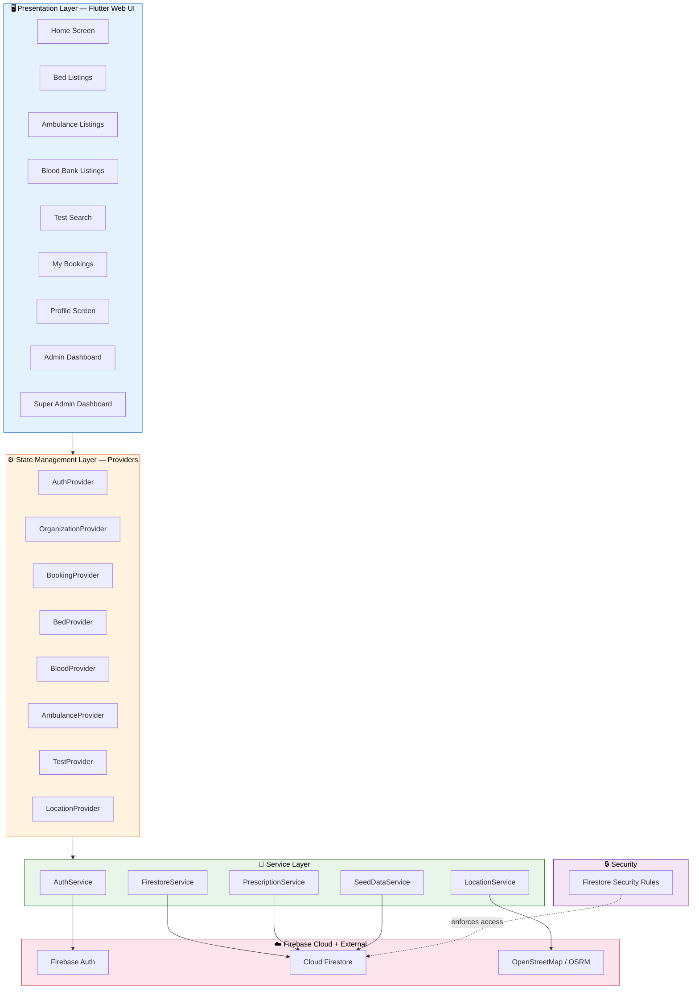

---

## Figure 2: Use Case Diagram

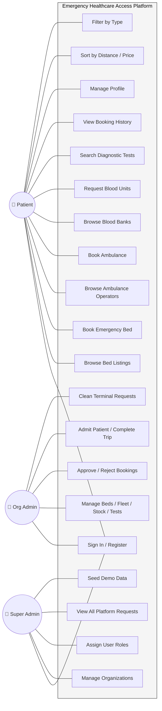

---

## Figure 3: Context Level Diagram (DFD-0)

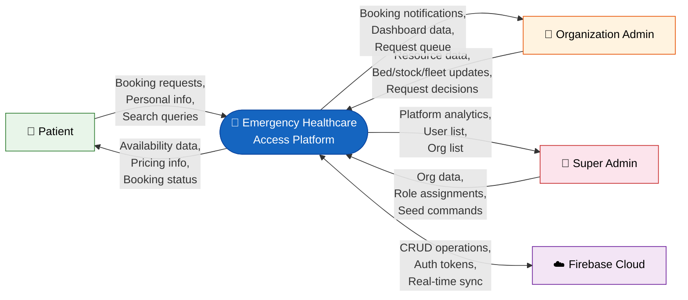

---

## Figure 4: Data Flow Diagram (DFD-1) — Bed Booking

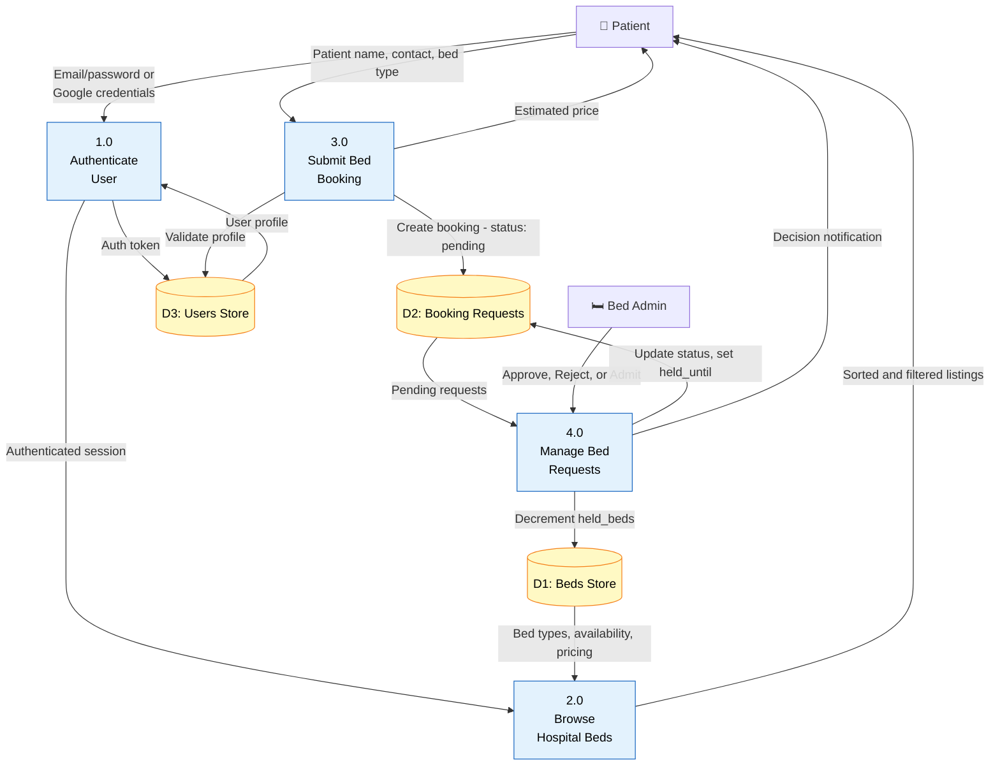

---

## Figure 5: Data Flow Diagram (DFD-1) — Blood Request

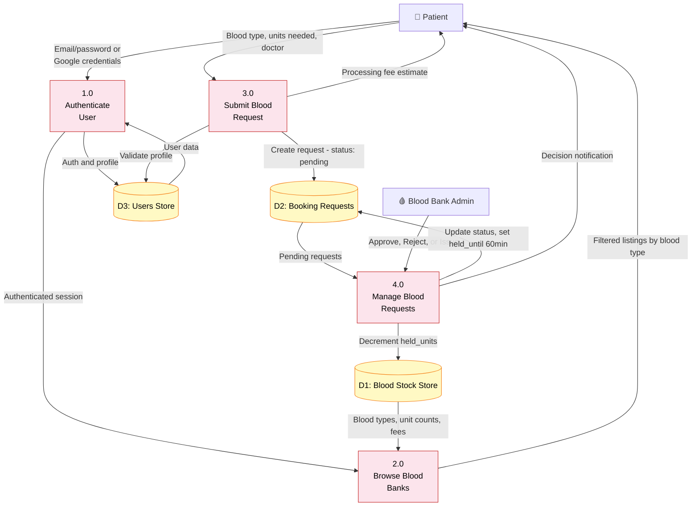

---

## Figure 6: Data Flow Diagram (DFD-1) — Ambulance Booking

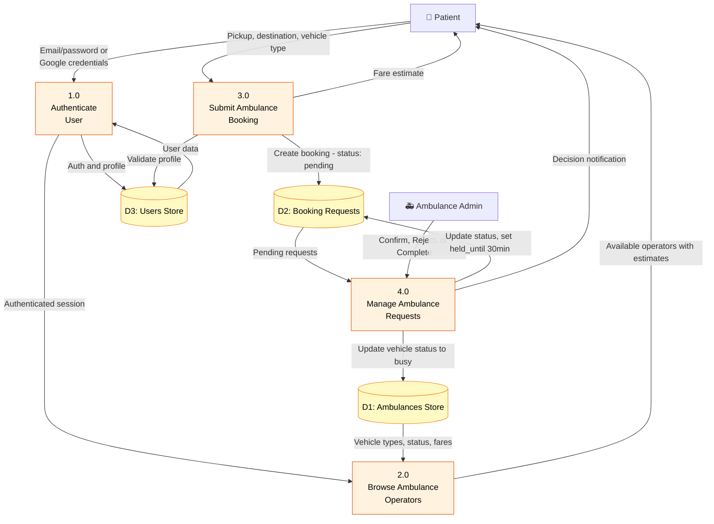

---

## Figure 7: Database Schema Diagram

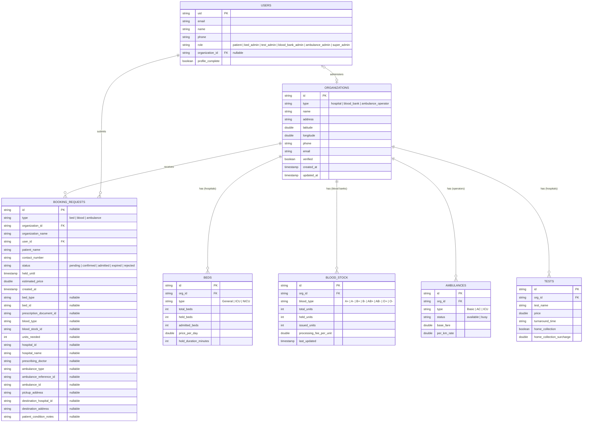

---

## Figure 8: Booking Lifecycle Flowchart

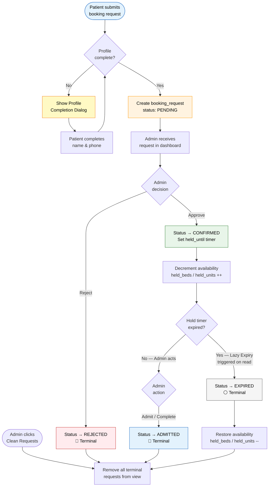

---

## Figure 9: Authentication & Role Assignment Flowchart

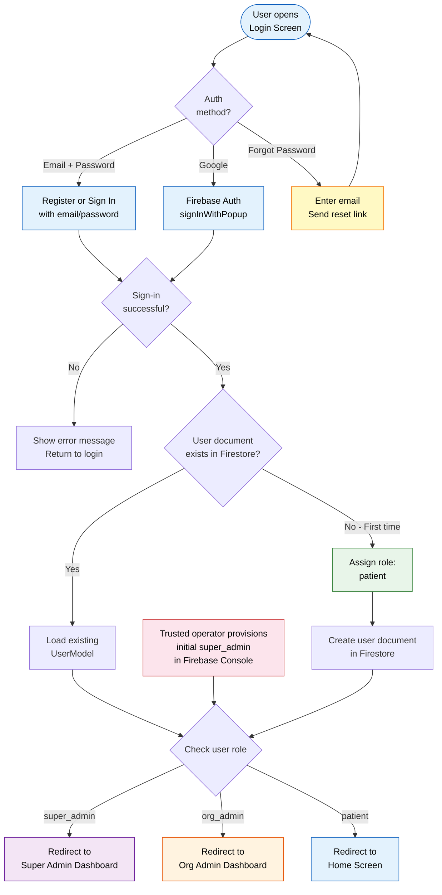

---

## Figure 10: Lazy Expiry Algorithm Flowchart

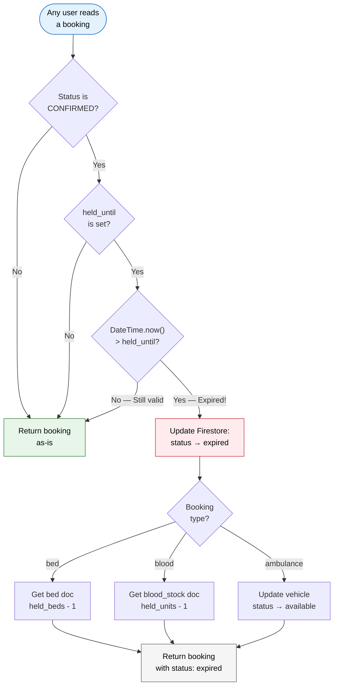

---

## Figure 11: Route Guard / Navigation Flowchart

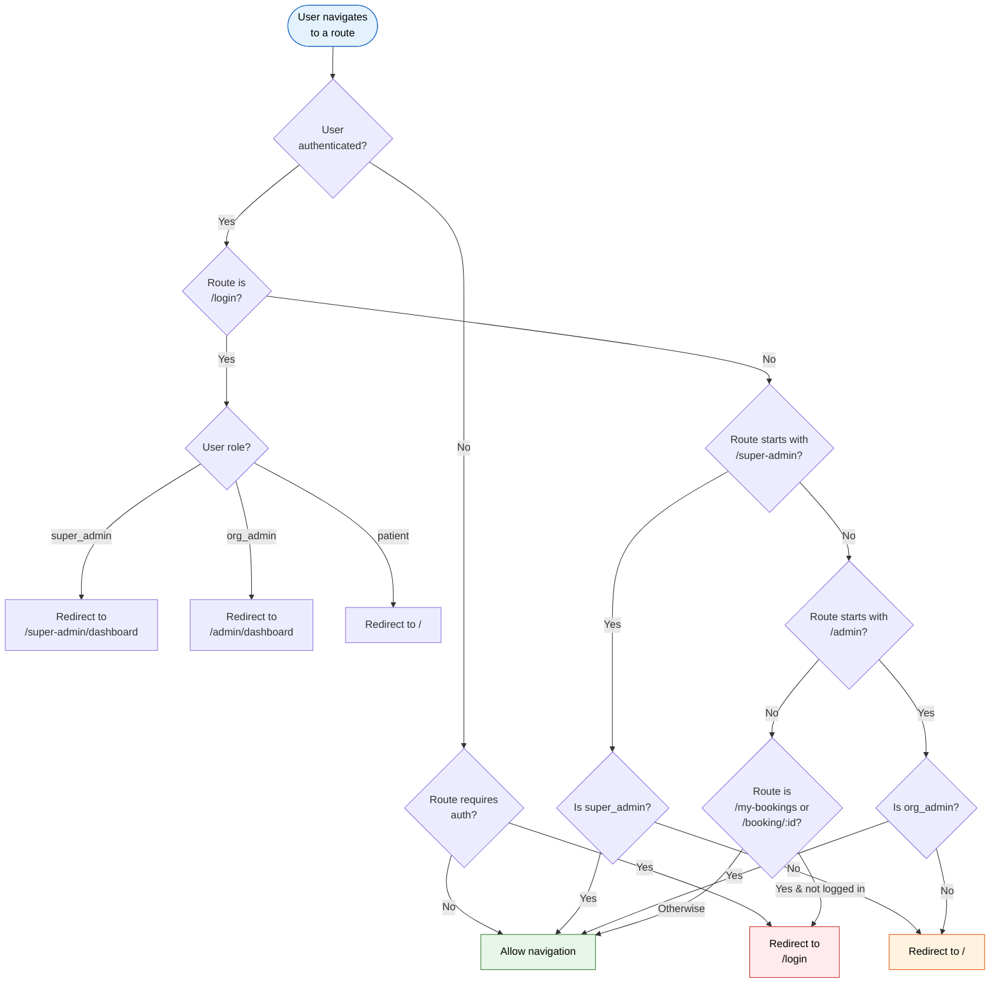

---

## Figure 12: Super Admin — Platform Management Flow

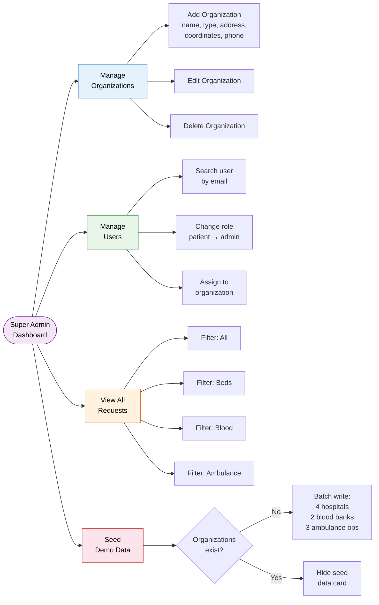

---

## Figure 13: State Management Architecture

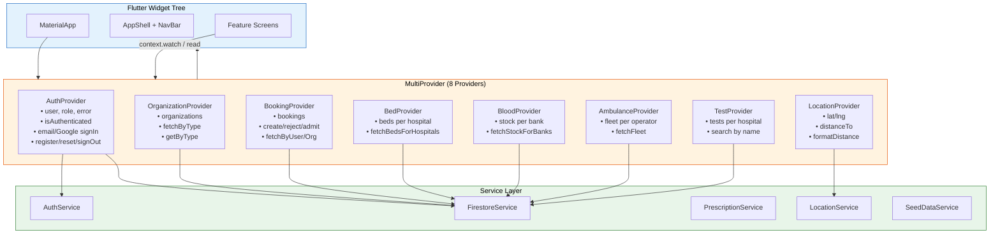

---

## Figure 14: Firestore Security Rules — Access Control Matrix

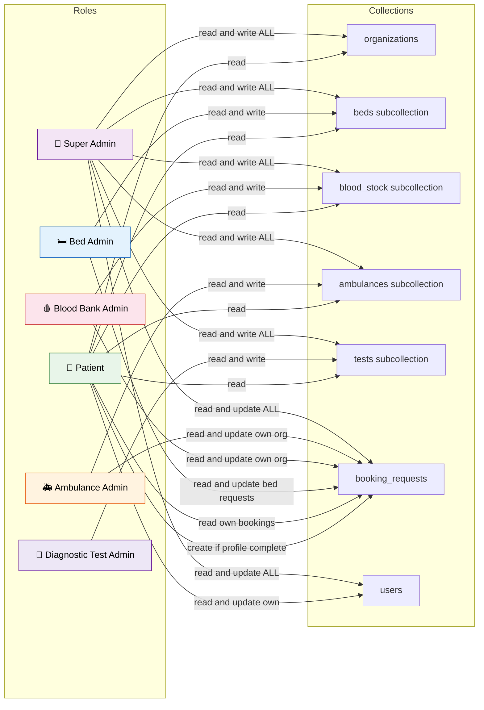
